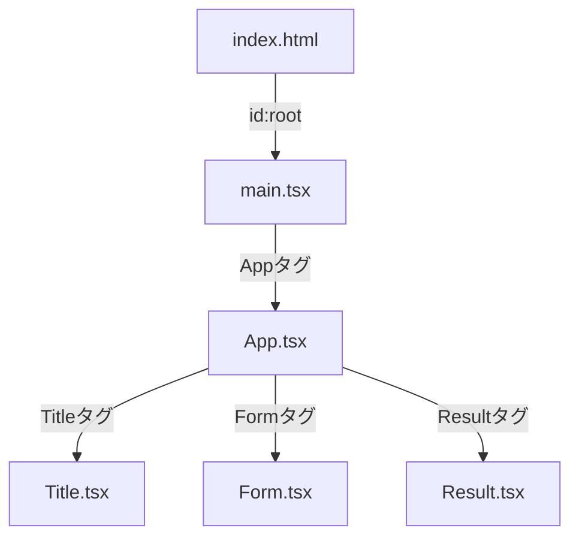

`react`では`component`という単位で画面を構築します。

## 全体の構成

```mermaid
graph TD
    index[index.html] -->|id:root| main[main.tsx]
    main -->|Appタグ| app[App.tsx]
    app -->|Titleタグ| title[Title.tsx]
    app -->|Formタグ| form[Form.tsx]
    app -->|Resultタグ| result[Result.tsx]
```
